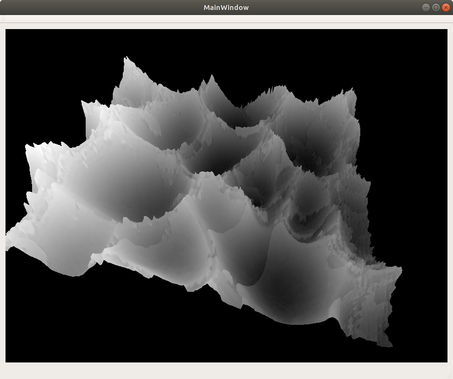
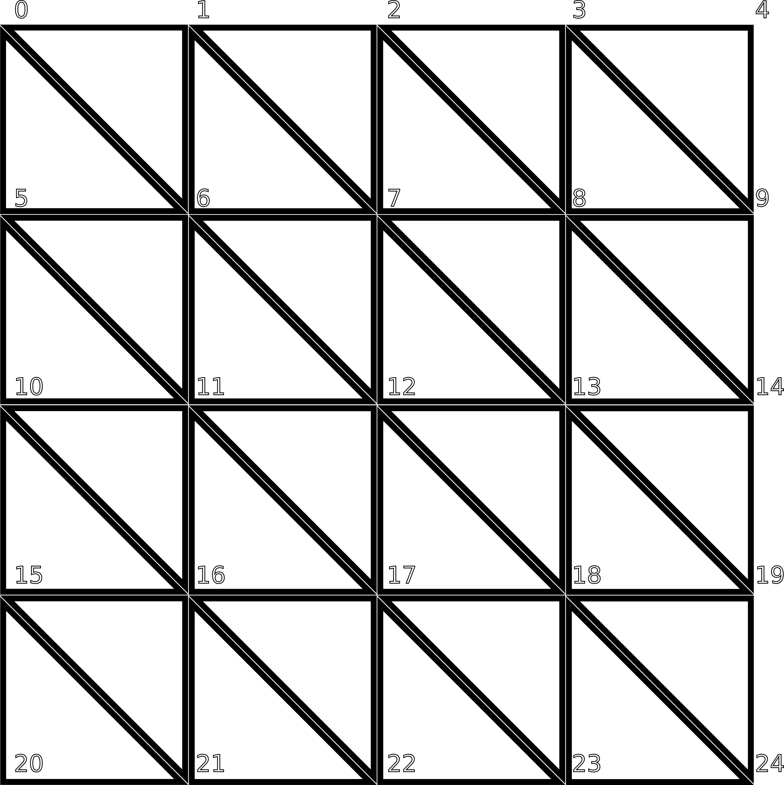

# Hello ES2
Eine OpenGL-Demo die eine Heightmap anzeigt.

<center>

</center>

### Features
  * OpenGL ES 2.0 profile mit Qt 5 als GUI toolkit
  * Interaktives Drehen mit der Maus
  * Zoom mit dem Scrollrad
  
### Build
```sh
user@host$ qmake .
user@host$ make
user@host$ ./HelloES2
```
  
### Details
Das meiste passiert in der MOpenGLWidget-Klasse, die ein vordefiniertes Bild aus den Ressourcen herauslädt und eine Flächengeometrie mit folgendem Muster erzeugt:


Eine Fläche mit `planeSegments=4`.


Da OpenGL jedoch nur Dreiecke entgegennimmt, müssen, wie aus der Grafik ersichtlich, noch entsprechende Indizes generiert werden, d.h. `0 1 6 | 0 5 6  | 1 2 7 | 1 6 7 | ...`.

Danach ist das Zeichnen der Fläche fertig, es fehlt nur noch das Zeichnen der Textur und das Displacement mithilfe der Höhenkarte.
Als Texturkoordinaten werden wieder die Vertices verwendet, die bei der Erzeugung normalisiert wurden, d.h. der untere rechte(?) Punkt hat die Koordinaten `(1.0 | 1.0)`. Nach dem Bereitstellen der Textur mit einer Qt-Helferklasse kann dann im Vertexshader `simple.vsh` die Z-Koordinate nach den Pixelwerten der angegebenen Textur verändert werden. Ein hoher bzw. heller Pixelwert sorgt für eine Verschiebung nach oben, ein dunkler nach unten.